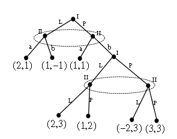

# gametree
object for game theory tree implementation.

---
## Example

Example is available after running `python gametree.py` in terminal. 
Example will create tree as shown below:

Any additional help can be called via `help(GameTree)` inside script or found in comments.

---
## Functions
### Creation and manipulation of tree
* create tree object: `tree = GameTree()`
* add node:

        tree.add_node({
            'id': '3',
            'value': [2, 1],
            'parents': {'1': 'a'}
        })
        
    This method will raise `ValueError`, if node with ID exists and `override=False`.
    To overwrite existing node, please use:
    
        tree.add_node({
            'id': '3',
            'value': [2, 1],
            'parents': {'1': 'a'}
        }, override=True)
   
    or use method `change_node`.
    
* change node with change method:

        tree.change_node({
            'id': '3',
            'value': [-300, 0]
        })
        
    Method will overwrite properties provided in dictionary, leaving other properties of node unchanged.

* add information set:

        tree.set_group(['1', '2'])
    
* print documentation of class
    
        help(GameTree)

* get tree as jsonified text:

        print(tree)

### Leafs
* populate list of leafs - not done automatically, as in big trees can kill performance:
        
        tree.calculate_leafs()
        
* get list of leafs from tree:
    
        print(tree.get_leafs())

* get expected value of tree:

        print(tree.exp())

### Income

GameTree provides function for the return of income for players - `get_income_for_path`.
This method contains two arguments: path and mode for search. Mode can have two values: `nodes` or `moves`.
`nodes` allows to search via nodes IDs, and moves - via player's choices.

Default mode value is `nodes`.

Method will raise `IndexError`, if there is no connection between nodes in provided path.

* get list of income for players via nodes ID' path

        path_ = ['2', '6', '8', '12']
        print('tree value for path\n%s\nis %s\n' % (
            path_, 
            tree.get_income_for_path(path_)
            )
        )

* get list of income for players via players moves' path

        path_ = ['P', 'b', 'L', 'P']
        print('tree value for path\n%s\nis %s\n' % (
            path_, 
            tree.get_income_for_path(
                path=path_,
                mode='moves'
                )
            )
        )

* get dictionary of income per leaf

        print(tree.get_income_for_leafs())

